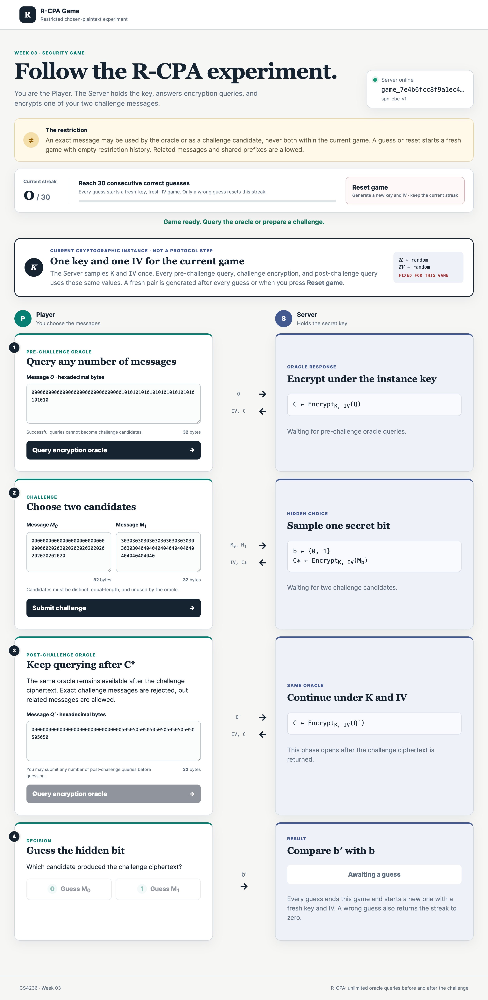

# R-CPA Game — Reused-IV CBC

## Page preview

This service presents a restricted chosen-plaintext (R-CPA) security game as a
conversation between a Player and a Server. The Server owns a secret key and
initialization vector (IV). The Player may ask an encryption oracle about
any number of chosen messages, submit two challenge candidates, continue making
any number of oracle queries, and then guess which candidate the Server
encrypted.

An exact plaintext may be
used by the encryption oracle or as a challenge candidate, but never both
during the same game instance. 

For example, if "apple" is used as the challenge message, player cannot query the encryption of "apple". Similarly, if the encryption of "apple" was queried before, the message "apple" cannot be used as one of the challenge message.

The difference between a normal CPA game from the lecture and this R-CPA game is that normal CPA allows the query of any message, include the challenge message. 
R-CPA game on the other hand does not. Therefore, you can consider R-CPA is a model where the adversary is weaker. 

In general, proving security against a stronger adversary is more desirable. 
However, in this challenge, we will show that CBC with fix IV is not even secure against this weaker adversary.

## Cryptographic instance

The default suite is `spn-cbc-v1`, which uses the Week 3 CBC implementation
with PKCS#7 padding:

~~~text
C[0] = SPN_encrypt(key, P[0] XOR IV)
C[i] = SPN_encrypt(key, P[i] XOR C[i - 1])
~~~

The Server generates a random 16-byte key and random 16-byte IV at the start of
each R-CPA game. This initialization is a game-level setup rule, not a numbered
query step. Every pre-challenge oracle query, the challenge encryption, and
every post-challenge oracle query in that game reuses the same key and IV.

Submitting a guess ends the current game. Unless that guess completes the
30-win objective, the Server immediately starts the next game with a new key,
new IV, and empty message-restriction history. The HTTP `game_id` remains the
same so that it can carry the streak between games.

Win 30 games in a row to reveal the Server's startup secret. A correct guess
adds one to the streak; a wrong guess sets the streak to zero. Both outcomes
start the next game with a new key and IV. A manual reset abandons the current
game and creates a new key and IV, but preserves the current streak.

Encryption responses split the public IV and ciphertext into two fields:

~~~json
{
  "iv_hex": "16-byte initialization vector",
  "ciphertext_hex": "PKCS#7-padded CBC ciphertext"
}
~~~

## R-CPA restriction

Within one game, an exact decoded plaintext may appear on only one side of the
game:

- After a successful oracle query for `Q`, neither challenge candidate may
  equal `Q`.
- After a successful challenge containing `M0` and `M1`, neither message may
  be queried through the oracle before the guess ends that game.
- Repeating a message on the same side is allowed. Related messages and shared
  prefixes are also allowed.
- There is no oracle-query limit. Queries may be made before the challenge and
  after its ciphertext is returned, until the Player submits a guess.
- Rejected requests do not add their messages to the history.

## Setup

### macOS and Linux

From the course-material repository:

~~~bash
SECRET='replace-me' python3 server.py
~~~

Then open `http://127.0.0.1:8000`.

### Windows PowerShell

~~~powershell
$env:SECRET = 'replace-me'
py server.py
~~~

Then open `http://127.0.0.1:8000`.

## HTTP API

All request and response bodies are JSON. Hexadecimal message fields may
contain whitespace accepted by `bytes.fromhex`. Successful encryption requests
accept nonempty plaintexts of at most 4096 bytes.

### Health

~~~text
GET /health
~~~

Returns `200 OK`:

~~~json
{
  "status": "ok",
  "service": "rcpa-game"
}
~~~

### Create a game

~~~text
POST /api/v1/games
~~~

No request body is required. Returns `201 Created`:

~~~json
{
  "game_id": "game_...",
  "suite": {
    "name": "spn-cbc-v1",
    "ciphertext_group_bytes": 16
  },
  "wins": 0,
  "wins_required": 30
}
~~~

Save `game_id`; all remaining operations are scoped to that game.
`ciphertext_group_bytes` is display metadata. It may be `null` for a future
cipher suite whose output should not be grouped.

### Reset a game

~~~text
POST /api/v1/games/{game_id}/reset
~~~

No request body is required. The Server abandons the current game, generates a
new key and IV, cancels an active challenge, and clears both restriction
histories and completion state. The streak and `game_id` remain unchanged.

Returns `200 OK` with the same game object returned by game creation.
An unknown `game_id` returns `404 Not Found`. Reset is allowed during an active
challenge and after the secret has been revealed.

### Query the encryption oracle

~~~text
POST /api/v1/games/{game_id}/oracle
Content-Type: application/json
~~~

Request:

~~~json
{
  "message_hex": "00112233"
}
~~~

Returns `200 OK`:

~~~json
{
  "iv_hex": "...",
  "ciphertext_hex": "..."
}
~~~

The successful query records the decoded message in the oracle history. This
endpoint may be called any number of times before a challenge and any number of
times while a challenge is active. Querying a message found in the challenge
history returns `409 Conflict`.

### Create a challenge

~~~text
POST /api/v1/games/{game_id}/challenge
Content-Type: application/json
~~~

Request:

~~~json
{
  "left_hex": "00112233",
  "right_hex": "44556677"
}
~~~

The decoded candidates must be nonempty, distinct, equal-length, at most 4096
bytes each, and absent from the oracle history. The Server samples a new hidden
bit `b`, encrypts the corresponding candidate, and records both candidates in
the challenge history.

Returns `201 Created`:

~~~json
{
  "iv_hex": "...",
  "ciphertext_hex": "..."
}
~~~

Only one challenge may be active. Starting another before guessing returns
`409 Conflict`.

### Guess the hidden bit

~~~text
POST /api/v1/games/{game_id}/guess
Content-Type: application/json
~~~

Submit `0` for the left candidate or `1` for the right candidate:

~~~json
{
  "guess": 0
}
~~~

A non-final response returns `200 OK`:

~~~json
{
  "correct": true,
  "wins": 1,
  "wins_required": 30,
  "complete": false
}
~~~

The 30th consecutive correct response additionally contains the exact startup
secret:

~~~json
{
  "correct": true,
  "wins": 30,
  "wins_required": 30,
  "complete": true,
  "secret": "replace-me"
}
~~~

Guessing without an active challenge returns `409 Conflict`. After completion,
oracle, challenge, and guess operations return `409 Conflict` until reset.
Every non-final guess ends the current game and automatically starts the next
one with a new key, new IV, and empty restriction history. A correct guess
carries the incremented streak forward; a wrong guess carries a zero streak.

## Complete request flow

The normal sequence is:

~~~text
POST /api/v1/games
  -> save game_id

POST /api/v1/games/{game_id}/oracle       (zero or more times)
  {"message_hex":"..."}
  -> receive iv_hex and ciphertext_hex

POST /api/v1/games/{game_id}/challenge
  {"left_hex":"...","right_hex":"..."}
  -> receive the hidden candidate's iv_hex and ciphertext_hex

POST /api/v1/games/{game_id}/oracle       (zero or more times)
  {"message_hex":"..."}
  -> continue querying before the guess

POST /api/v1/games/{game_id}/guess
  {"guess":0}
  -> receive correctness and score; the next game starts with a new key and IV

POST /api/v1/games/{game_id}/reset
  -> optional fresh key, IV, and history; keep the current streak
~~~

The same oracle endpoint serves both query phases. Within one game, all queries
share one restriction history and the same key and IV. Repeat the oracle →
challenge → oracle → guess sequence for each consecutive win; each repetition
after a guess uses the next game's fresh key and IV.

## Errors

Every error response has this shape:

~~~json
{
  "error": "human-readable explanation"
}
~~~

| Status | Meaning |
| --- | --- |
| `400 Bad Request` | Malformed JSON, invalid hexadecimal text, an invalid guess, empty or oversized messages, or invalid candidate lengths/equality. |
| `404 Not Found` | Unknown game ID or route. |
| `409 Conflict` | Cross-side message reuse, invalid game phase, an active challenge already exists, or the game is complete. |
| `413 Content Too Large` | The HTTP request body exceeds the server limit. |

## Attack objective

As an adversary, win the R-CPA game.

Create `src/educrypto/attacks/week03.py`:

~~~python
def solve(base_url: str) -> str:
    ...
~~~

The function must use the supplied base URL, win 30 consecutive rounds, and
return the exact secret. It must not start a server or assume a fixed host or
port.

## Testing

From the course-material repository root:

~~~bash
python3 -m pytest -q course/week03 -m "attack" -s
~~~

Pytest starts a temporary server on an available port and passes its complete
URL to `solve`.
