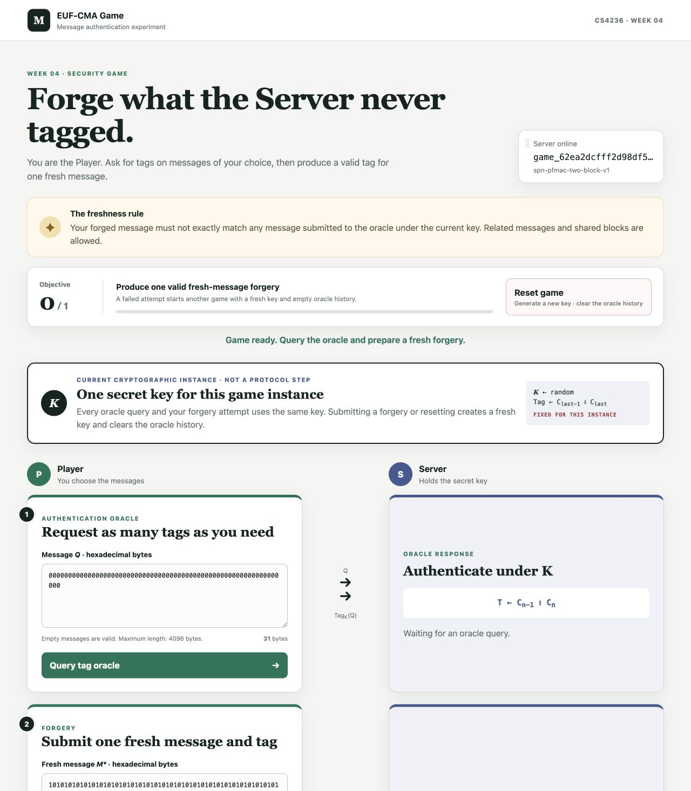

# EUF-CMA Game — Two-Block PFMAC Tag

## Page preview

This service presents an existential-unforgeability-under-chosen-message-attack
(EUF-CMA) game as a conversation between a Player and a Server. The Server owns
a secret key and answers authentication-oracle queries. The Player wins a round
by submitting a valid tag for a fresh message: an exact message that was not
previously sent to the oracle under the current key.

There is no query limit. Related messages, shared blocks, and messages of equal
length are allowed. Repeating a message on the oracle side is also allowed, but
that exact message can no longer be a successful forgery during the round.

## Cryptographic instance

The suite is `spn-pfmac-two-block-v1`. It uses the Week 2 SPN, the fixed AES
S-box in `service.py`, ten rounds, PKCS#7 padding, and zero-IV CBC.

For a message `M`, let `padded` be its PKCS#7 padding and let `n` be the number
of 16-byte blocks in `padded`. Encode `n` as one unsigned 16-byte big-endian
block `L`, then apply CBC to:

~~~text
L || padded
~~~

If the resulting ciphertext blocks are `C[0]` through `C[n]`, correct PFMAC
would expose only `C[n]`. This application instead returns:

~~~text
tag = C[n - 1] || C[n]
~~~

The 32-byte response therefore exposes two consecutive CBC chaining values.
The same representation is expected when the Server verifies a forgery.

The Server generates a random 16-byte key at the start of each game instance.
Every oracle query and the forgery attempt uses the same key. A failed,
well-formed forgery starts another instance with a fresh key.

## Objective and state changes

Produce one valid tag for one fresh message to reveal the Server's startup
secret.

- A valid tag on a fresh message immediately completes the game.
- An invalid tag starts another attempt with a fresh key and empty oracle
  history.
- A valid tag on a previously queried message also fails because the message is
  not fresh, then starts another fresh-key attempt.
- The Reset button abandons the current instance, generates a fresh key, clears
  the oracle history, and restarts the objective.
- Malformed requests are rejected without changing the current instance.

Messages may contain from 0 through 4096 bytes. Hexadecimal message fields may
therefore be empty. A submitted tag must contain exactly 32 bytes.

## Setup

Install the challenge dependency into the same Python environment that contains
your editable `educrypto` library.

### macOS and Linux

From the course-material repository root:

~~~bash
python3 -m pip install -r course/week04/challenge/requirements.txt
cd course/week04/challenge
SECRET='replace-me' python3 server.py
~~~

Then open `http://127.0.0.1:8000`.

### Windows PowerShell

From the course-material repository root:

~~~powershell
py -m pip install -r course/week04/challenge/requirements.txt
Set-Location course/week04/challenge
$env:SECRET = 'replace-me'
py server.py
~~~

Then open `http://127.0.0.1:8000`.

## Student attack entry point

Create `src/educrypto/attacks/week04.py` in your own library and implement:

~~~python
def solve(base_url: str) -> str:
    ...
~~~

The function must create a game, use the HTTP API to submit one successful
fresh-message forgery, and return the exact startup secret as a string. It must
not start the server or assume a fixed hostname or port.

## HTTP API

All request and response bodies are JSON. Hexadecimal fields may contain
whitespace accepted by `bytes.fromhex`.

### Health

~~~text
GET /health
~~~

Returns `200 OK`:

~~~json
{
  "status": "ok",
  "service": "euf-cma-game"
}
~~~

### Create a game

~~~text
POST /api/v1/games
~~~

No request body is required. Returns `201 Created`:

~~~json
{
  "game_id": "game_...",
  "suite": {
    "name": "spn-pfmac-two-block-v1",
    "tag_group_bytes": 16,
    "tag_bytes": 32
  },
  "wins": 0,
  "wins_required": 1
}
~~~

Save `game_id`; all remaining operations are scoped to this game. The grouping
value is display metadata and separates the two ciphertext blocks in the tag.

### Reset the current game instance

~~~text
POST /api/v1/games/{game_id}/reset
~~~

No request body is required. The Server creates a new key, clears the oracle
history, and restarts the objective. The game ID remains unchanged. Returns
`200 OK` with the same game object shape returned by game creation.

An unknown game ID returns `404 Not Found`. Reset is allowed after the objective
has been completed; doing so starts a new incomplete game instance.

### Query the authentication oracle

~~~text
POST /api/v1/games/{game_id}/oracle
Content-Type: application/json
~~~

Request:

~~~json
{
  "message_hex": "00112233"
}
~~~

The empty string is a valid empty message. A successful request records the
decoded message in the oracle history and returns `200 OK`:

~~~json
{
  "tag_hex": "32-byte two-block tag"
}
~~~

The endpoint may be called any number of times before the forgery attempt.
Repeated messages return the same deterministic tag and remain one exact entry
in the restriction history.

### Submit a forgery

~~~text
POST /api/v1/games/{game_id}/forge
Content-Type: application/json
~~~

Request:

~~~json
{
  "message_hex": "fresh message",
  "tag_hex": "exactly 32 bytes"
}
~~~

A well-formed request returns `200 OK`:

~~~json
{
  "valid": true,
  "fresh": true,
  "wins": 1,
  "wins_required": 1,
  "complete": true,
  "secret": "the exact startup secret"
}
~~~

`valid` is true only when the tag verifies and `fresh` is true. A successful
forgery immediately includes the secret. An invalid or non-fresh attempt returns
the same response shape with `valid: false`, `wins: 0`, and `complete: false`,
then starts a fresh-key instance.

### Errors

Errors return JSON in this form:

~~~json
{
  "error": "human-readable explanation"
}
~~~

Common responses are:

- `400 Bad Request`: malformed JSON or hexadecimal, a message longer than 4096
  bytes, or a tag not exactly 32 bytes.
- `404 Not Found`: unknown route or game ID.
- `405 Method Not Allowed`: wrong HTTP method.
- `409 Conflict`: an operation on a completed game before reset.
- `413 Content Too Large`: an HTTP request body larger than the service limit.

Validation errors do not record oracle messages, submit a forgery, change the
key, or alter objective progress.
