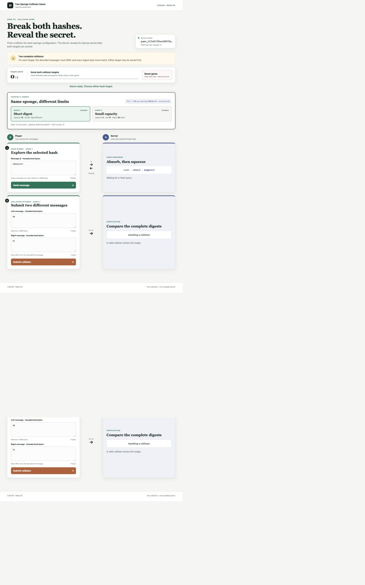
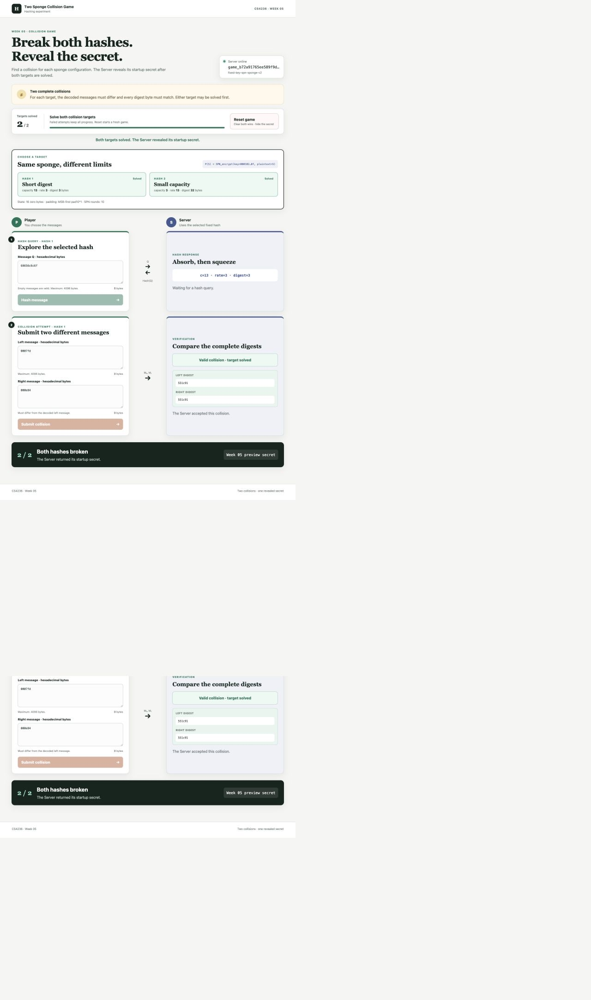

# Two-Hash Sponge Collision Game

## Page preview

Find a collision in each of two fixed sponge configurations. A collision is a
pair of different decoded messages whose complete digests match. After both
targets are solved, the Server returns its startup secret.

## Hash construction

Both targets call the `educrypto.hashing.sponge_hash` function you implement
this week. They share these parameters:

| Parameter | Value |
| --- | --- |
| State | 16 zero bytes at the start of every hash |
| Permutation key | `000102030405060708090a0b0c0d0e0f` |
| S-box | supplied Week 5 AES S-box |
| SPN rounds | 10 |
| Padding | MSB-first `pad10*1` |

The Server fixes the capacity and digest length:

| Target | Capacity | Rate | Digest length |
| --- | ---: | ---: | ---: |
| `hash1` | 13 bytes | 3 bytes | 3 bytes |
| `hash2` | 3 bytes | 13 bytes | 32 bytes |

All sizes are bytes. For capacity `c`, the rate is `16 - c`. Absorb padded
blocks into the first rate bytes, preserving the final capacity bytes, and
apply the fixed-key SPN after every block. Squeezing emits the first rate bytes,
applies the SPN between output blocks, and stops at the exact digest length.
The Week 5 README gives the complete algorithm and padding examples.

Every query begins from the same zero state. There is no random IV in a game
response, and one query never changes a later result.

## Objective and completion

- Solve `hash1` and `hash2` once each, in either order.
- The two decoded messages for a target must differ, and their complete target
  digests must match.
- The Server calculates both digests. You do not submit a claimed digest.
- The first accepted target records one win and does not reveal the secret.
- Solving the remaining target completes the game and returns the exact
  startup secret in the successful response.
- A failed attempt keeps all existing progress.
- Once a target is solved, hashing or submitting to it returns `409`. The
  unsolved target remains available.
- Reset keeps the game ID and clears both wins and any displayed secret.
- Different game IDs have independent progress.

Messages may contain 0 through 4096 bytes before padding. Hex fields may be
empty. Messages are compared after decoding: hex letter case or whitespace
does not make equal byte strings different.

## Browser workflow

1. Start the Server and open its page.
2. Select either target card.
3. Use **Hash query** to inspect complete digests while developing your attack.
4. Enter distinct colliding messages under **Collision submission**.
5. Solve the remaining target. The Server returns and displays the secret.

**Reset game** clears both wins, hides the secret, and starts a fresh attempt.
The hash functions remain fixed.

## Setup and server startup

Install the dependency in the environment containing your editable
`educrypto` package.

### macOS and Linux

From the course-material repository:

~~~bash
python3 -m pip install -r course/week05/challenge/requirements.txt
cd course/week05/challenge
SECRET='replace-me' python3 server.py
~~~

Open `http://127.0.0.1:8000`. Stop the Server with Ctrl+C.

### Windows PowerShell

From the course-material repository:

~~~powershell
py -m pip install -r course/week05/challenge/requirements.txt
Set-Location course/week05/challenge
$env:SECRET = 'replace-me'
py server.py
~~~

Open `http://127.0.0.1:8000`. Stop the Server with Ctrl+C.

The startup secret must be non-empty. The Server accepts `--host` and
`--port`, for example `py server.py --port 8001`.

## Student attack entry point

Create `src/educrypto/attacks/week05.py`:

~~~python
def solve(base_url: str) -> str:
    ...
~~~

Create one game, find both collisions, submit them, and return the exact secret
from the response that completes the game. Use `base_url`; do not start a
server, access `SECRET`, or assume a hostname or port. Compute your collisions
instead of hard-coding answers.

## HTTP API

Requests and responses with bodies use JSON. Creation and reset need no body.
Digest bytes are lowercase hex in responses. Request hex follows Python's
`bytes.fromhex`, so ASCII whitespace between whole bytes is accepted.

### Health

~~~text
GET /health
~~~

Returns `200 OK`:

~~~json
{"status": "ok", "service": "sponge-collision-game"}
~~~

### Create a game

~~~text
POST /api/v1/games
~~~

Returns `201 Created`:

~~~json
{
  "game_id": "game_...",
  "suite": {
    "name": "fixed-key-spn-sponge-v2",
    "state_bytes": 16,
    "rounds": 10,
    "padding": "pad10*1-msb"
  },
  "hashes": [
    {
      "hash_id": "hash1",
      "capacity_bytes": 13,
      "rate_bytes": 3,
      "digest_bytes": 3,
      "solved": false
    },
    {
      "hash_id": "hash2",
      "capacity_bytes": 3,
      "rate_bytes": 13,
      "digest_bytes": 32,
      "solved": false
    }
  ],
  "wins": 0,
  "wins_required": 2,
  "complete": false
}
~~~

Save `game_id`. The `hashes` entries give the fixed parameters and current
solved status.

### Reset a game

~~~text
POST /api/v1/games/{game_id}/reset
~~~

Returns `200 OK` with the creation shape. The ID stays the same and both
targets become unsolved.

### Hash a message

~~~text
POST /api/v1/games/{game_id}/hash
Content-Type: application/json
~~~

Request:

~~~json
{"hash_id": "hash1", "message_hex": "001122"}
~~~

Response:

~~~json
{"hash_id": "hash1", "digest_hex": "abcdef"}
~~~

`hash_id` is required and must be `hash1` or `hash2`. The complete digest
is six hex characters for `hash1` and 64 for `hash2`.

### Submit a collision

~~~text
POST /api/v1/games/{game_id}/collide
Content-Type: application/json
~~~

Request shape, with values that are examples only:

~~~json
{"hash_id": "hash1", "left_hex": "000000", "right_hex": "000001"}
~~~

A well-formed failed attempt returns `200 OK`:

~~~json
{
  "hash_id": "hash1",
  "valid": false,
  "distinct": true,
  "left_digest_hex": "123456",
  "right_digest_hex": "654321",
  "wins": 0,
  "wins_required": 2,
  "complete": false
}
~~~

The first accepted collision records one win:

~~~json
{
  "hash_id": "hash1",
  "valid": true,
  "distinct": true,
  "left_digest_hex": "123456",
  "right_digest_hex": "123456",
  "wins": 1,
  "wins_required": 2,
  "complete": false
}
~~~

The accepted collision for the remaining target includes the secret:

~~~json
{
  "hash_id": "hash2",
  "valid": true,
  "distinct": true,
  "left_digest_hex": "...",
  "right_digest_hex": "...",
  "wins": 2,
  "wins_required": 2,
  "complete": true,
  "secret": "replace-me"
}
~~~

The `secret` field is present only when `complete` is true.

### Errors

Errors use `{"error": "human-readable explanation"}`.

| Status | Meaning |
| --- | --- |
| `400 Bad Request` | Malformed JSON, missing/unknown `hash_id`, invalid hex, or a message over 4096 bytes. |
| `404 Not Found` | Unknown route or game ID. |
| `405 Method Not Allowed` | Wrong HTTP method. |
| `409 Conflict` | The selected target is already solved. |
| `413 Content Too Large` | Request body exceeds 1,000,000 bytes. |

Validation failures do not change wins or reveal the secret.

## Running challenge feedback

From the course-material repository on macOS/Linux:

~~~bash
python3 -m pytest -q course/week05 -m "attack" -s
~~~

On Windows PowerShell:

~~~powershell
py -m pytest -q course/week05 -m "attack" -s
~~~

The test starts a temporary Server, supplies its URL to `solve`, and checks
the returned Unicode string. The longer collision search can take some time.
