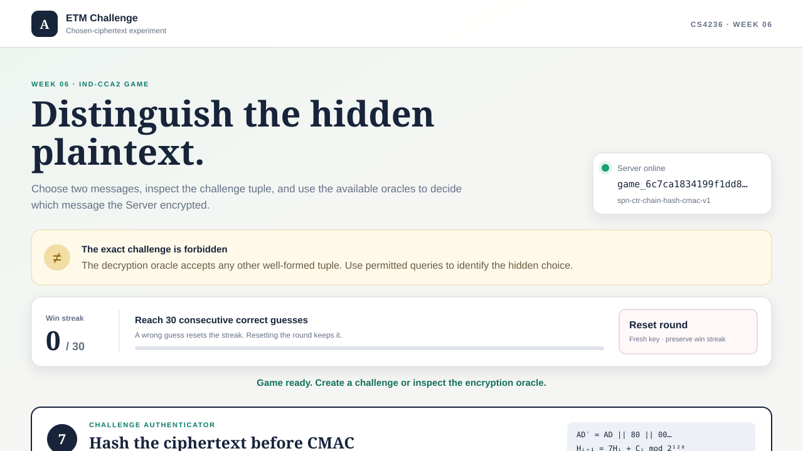

# ETM IND-CCA2 Game

## Page preview

Analyze an encrypt-then-MAC construction in a chosen-ciphertext game. Win 30
consecutive rounds and the Server returns its startup secret.

## Construction

Each round uses a fresh secret 48-byte key split into a 16-byte CTR key and a
32-byte course-CMAC key. Every encryption uses a fresh random 8-byte IV.
Associated data may contain 0 through 15 bytes.

~~~text
ciphertext = CTR_encrypt(K_enc, plaintext, IV)
padded_AD  = associated_data || 0x80 || zero bytes
digest     = challenge_hash(ciphertext)
tag        = CMAC(K_mac, IV || padded_AD || digest)
~~~

CTR starts at counter zero and applies no padding. IV, associated data,
ciphertext, and tag are returned separately.

Pad associated data to exactly 16 bytes by appending `0x80` and then enough
zero bytes to fill the block. The original associated data must be at most 15
bytes so there is always room for `0x80`. The Server returns the original,
unpadded associated data.

The hash begins at the integer zero. It reads the ciphertext in 16-byte blocks:

~~~text
H = (7 * H + integer_big_endian(block)) mod 2^128
~~~

Zero-fill a final partial ciphertext block for the hash calculation only.
These fill bytes are not part of the ciphertext returned by CTR.

## Game rules

- The challenge candidates must be distinct decoded byte strings with equal
  lengths. Each may contain 0 through 4096 bytes.
- The challenge associated data may contain 0 through 15 bytes.
- Only one challenge may be active at a time.
- Encryption-oracle queries are available before and after the challenge.
- The decryption oracle accepts any well-formed tuple except the exact active
  challenge tuple.
- A valid tuple returns its complete plaintext. An invalid tag returns only
  `{"valid": false}`.
- A correct guess adds one win. A wrong guess resets the streak to zero.
- Every guess starts the next round with a fresh key. A manual reset also
  refreshes the key but preserves the current streak.
- Thirty consecutive correct guesses complete the game and reveal the exact
  startup secret.

## Browser workflow

1. Start the Server and open the page.
2. Optionally use the encryption oracle to inspect the four AEAD components.
3. Enter two challenge candidates and an associated-data value of at most 15
   bytes.
4. Copy the challenge tuple into the decryption-oracle form. It is copied there
   automatically by the page, but the exact tuple is forbidden.
5. Submit a permitted decryption query and use the response as evidence.
6. Guess whether the Server encrypted the left or right message.
7. Repeat until the streak reaches 30.

**Reset round** keeps the game ID and win streak but replaces the current key
and abandons an active challenge.

## Setup and server startup

Install the dependency in the environment containing your editable
`educrypto` package.

### macOS and Linux

From the course-material repository:

~~~bash
python3 -m pip install -r course/week06/challenge/requirements.txt
cd course/week06/challenge
SECRET='replace-me' python3 server.py
~~~

Open `http://127.0.0.1:8000`. Stop the Server with Ctrl+C.

### Windows PowerShell

From the course-material repository:

~~~powershell
py -m pip install -r course/week06/challenge/requirements.txt
Set-Location course/week06/challenge
$env:SECRET = 'replace-me'
py server.py
~~~

Open `http://127.0.0.1:8000`. Stop the Server with Ctrl+C.

The startup secret must be non-empty. Use `--host` and `--port` to change the
listener, for example `py server.py --port 8001`.

## Student attack entry point

Create `src/educrypto/attacks/week06.py`:

~~~python
def solve(base_url: str) -> str:
    ...
~~~

Create one game, win 30 consecutive rounds, and return the exact secret from
the final successful guess. Use `base_url`; do not start a server, access the
`SECRET` environment variable, or assume a hostname or port.

## HTTP API

Requests and responses with bodies use JSON. Byte strings use hexadecimal.
Request fields follow `bytes.fromhex`, so ASCII whitespace between complete
bytes is accepted. Response hex is lowercase.

### Health

~~~text
GET /health
~~~

Returns `200 OK`:

~~~json
{"status": "ok", "service": "etm-cca-game"}
~~~

### Create a game

~~~text
POST /api/v1/games
~~~

Returns `201 Created`:

~~~json
{
  "game_id": "game_...",
  "suite": {
    "name": "spn-ctr-chain-hash-cmac-v1",
    "block_bytes": 16,
    "iv_bytes": 8,
    "associated_data_max_bytes": 15,
    "associated_data_padding": "10-star-msb-16",
    "tag_bytes": 16,
    "rounds": 10,
    "hash_multiplier": 7
  },
  "wins": 0,
  "wins_required": 30,
  "complete": false
}
~~~

Save `game_id` for every later request.

### Reset the current round

~~~text
POST /api/v1/games/{game_id}/reset
~~~

Returns `200 OK` with the game-creation shape. The game ID and current wins are
unchanged. The Server discards any active challenge and uses a fresh key.

### Encryption oracle

~~~text
POST /api/v1/games/{game_id}/oracle/encrypt
Content-Type: application/json
~~~

Request:

~~~json
{
  "message_hex": "68656c6c6f",
  "associated_data_hex": "00112233445566778899aabbccddee"
}
~~~

Response:

~~~json
{
  "iv_hex": "0123456789abcdef",
  "associated_data_hex": "00112233445566778899aabbccddee",
  "ciphertext_hex": "...",
  "tag_hex": "...32 hexadecimal characters..."
}
~~~

Repeated encryption queries receive fresh IVs.

### Challenge

~~~text
POST /api/v1/games/{game_id}/challenge
Content-Type: application/json
~~~

Request:

~~~json
{
  "left_hex": "546865206c656674206d657373616765",
  "right_hex": "526967687420736964652077696e7321",
  "associated_data_hex": "00112233445566778899aabbccddee"
}
~~~

Returns `201 Created` with the same four-field AEAD response as the encryption
oracle. The Server encrypts either `left_hex` for hidden bit 0 or `right_hex`
for hidden bit 1.

### Decryption oracle

~~~text
POST /api/v1/games/{game_id}/oracle/decrypt
Content-Type: application/json
~~~

Request:

~~~json
{
  "iv_hex": "0123456789abcdef",
  "associated_data_hex": "00112233445566778899aabbccddee",
  "ciphertext_hex": "...",
  "tag_hex": "..."
}
~~~

A valid tag returns `200 OK`:

~~~json
{"valid": true, "plaintext_hex": "..."}
~~~

An invalid tag also returns `200 OK`, without plaintext:

~~~json
{"valid": false}
~~~

Submitting the exact active challenge tuple returns `409 Conflict`. Change at
least one decoded component before querying it.

### Submit a guess

~~~text
POST /api/v1/games/{game_id}/guess
Content-Type: application/json
~~~

Request:

~~~json
{"guess": 0}
~~~

Before the final win, the response is:

~~~json
{
  "correct": true,
  "wins": 1,
  "wins_required": 30,
  "complete": false
}
~~~

The thirtieth consecutive correct guess also includes:

~~~json
{"complete": true, "secret": "replace-me"}
~~~

### Errors

Errors use `{"error": "human-readable explanation"}`.

| Status | Meaning |
| --- | --- |
| `400 Bad Request` | Malformed JSON or invalid, missing, incorrectly sized, or oversized fields. |
| `404 Not Found` | Unknown route or game ID. |
| `405 Method Not Allowed` | Wrong HTTP method. |
| `409 Conflict` | No active challenge, another challenge is active, the exact challenge was submitted for decryption, or the game is complete. |
| `413 Content Too Large` | Request body exceeds 1,000,000 bytes. |

Validation failures do not alter the win streak or reveal the secret.

## Running challenge feedback

From the course-material repository on macOS/Linux:

~~~bash
python3 -m pytest -q course/week06 -m "attack" -s
~~~

On Windows PowerShell:

~~~powershell
py -m pytest -q course/week06 -m "attack" -s
~~~
