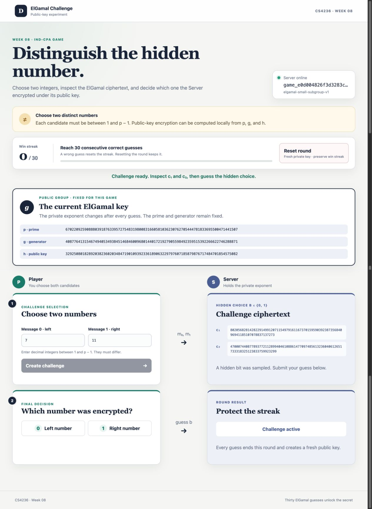

# ElGamal CPA game

## Page preview

The Server encrypts numeric group elements in a chosen-plaintext game. Submit
two different integers, inspect the ElGamal ciphertext, and guess which one
was encrypted. Win 30 consecutive rounds to receive the Server's startup
secret.

## Construction

The Server chooses a prime `p = 2 * q_small * q_large + 1`, with prime
`2^14 <= q_small < 2^15` and a 256-bit prime `q_large`.

It publishes `p`, `g = a^((p - 1)/q_small) mod p`, and a per-round public key
`h = g^x mod p`, where `x` is sampled uniformly from `1` through `p - 1`.

It chooses fresh encryption randomness each time and returns
`c1 = g^k mod p`, `c2 = m*h^k mod p` for message `m`.

## Game rules

- Messages are integers from `1` through `p - 1`. Challenge candidates must
  be distinct. Both are represented in decimal, not as byte strings.
- The Server has no encryption oracle. Anyone can encrypt locally with the
  public `p`, `g`, and `h`.
- Only one challenge may be active at a time; submit a guess before another.
- A correct guess adds one win. A wrong guess resets the win streak to zero.
- Each guess starts a new round with a fresh private key, while `p` and `g`
  remain the same. A manual reset also refreshes the key and clears the active
  challenge but preserves the current streak.
- The secret appears only after 30 consecutive correct guesses.

## Browser workflow

1. Start the Server and open the page.
2. The page creates a game and shows the current public `p`, `g`, and `h`.
3. Submit two distinct integers for a challenge and inspect `c1` and `c2`.
4. Guess left (`0`) or right (`1`). Repeat until the streak reaches 30.

The page uses decimal input and displays exact decimal integers. It never
rounds the large values through JavaScript `Number`.

**Reset round** keeps the game ID and win streak, replaces the private and
public key, and clears an active challenge.

## Setup and server startup

Copy the supplied `course/week08/primality.py` into your library and install
your library in editable mode.

### macOS and Linux

From the course-material repository:

~~~bash
python3 -m pip install -r course/week08/challenge/requirements.txt
cd course/week08/challenge
SECRET='replace-me' python3 server.py
~~~

### Windows PowerShell

From the course-material repository:

~~~powershell
py -m pip install -r course/week08/challenge/requirements.txt
Set-Location course/week08/challenge
$env:SECRET = 'replace-me'
py server.py
~~~

Open `http://127.0.0.1:8000`. Stop the Server with Ctrl+C. The startup secret
must be nonempty. Use `--host` and `--port` to change the listener.

## Student attack entry point

Create `src/educrypto/attacks/week08.py` with `solve(base_url: str) -> str`.
The function must use the supplied URL, win 30 consecutive rounds, and return
the exact secret from the final successful guess. The public attack feedback
starts a temporary local Server for you.

## HTTP API

Request and response bodies use JSON. Every large group integer is an exact
**decimal string**, including `p`, `g`, `h`, `left`, `right`, `c1`,
and `c2`. This allows browser clients to use `BigInt` without losing digits.
Decimal inputs contain ASCII digits only; leading zeros are accepted. A guess
is the JSON number `0` or `1`.

### Health and page

`GET /health` returns `200 OK`:

~~~json
{"status": "ok", "service": "elgamal-cpa-game"}
~~~

`GET /` serves the browser interface.

### Create a game

`POST /api/v1/games` returns `201 Created`:

~~~json
{
  "game_id": "game_...",
  "suite": "elgamal-small-subgroup-v1",
  "p": "...decimal integer...",
  "g": "...decimal integer...",
  "h": "...decimal integer...",
  "wins": 0,
  "wins_required": 30,
  "complete": false
}
~~~

Use the returned `game_id` in later routes. `p` and `g` stay fixed; `h`
changes each round.

### Reset a round

`POST /api/v1/games/{game_id}/reset` returns `200 OK` in the game-creation
shape with a fresh `h`, unchanged game ID and win streak, and no active
challenge.

### Challenge

`POST /api/v1/games/{game_id}/challenge` with:

~~~json
{"left": "7", "right": "11"}
~~~

returns `201 Created` with `c1` and `c2` as decimal strings. The Server chooses
a hidden bit: `0` selects `left` and `1` selects `right`.

### Guess

`POST /api/v1/games/{game_id}/guess` with:

~~~json
{"guess": 0}
~~~

returns `200 OK`. Before completion, the response includes the next round's
public key:

~~~json
{
  "correct": true,
  "wins": 1,
  "wins_required": 30,
  "complete": false,
  "h": "...next round public key..."
}
~~~

The thirtieth consecutive correct guess instead has `"complete": true` and
`"secret": "replace-me"`; it has no next-round `h`.

### Errors

Errors return `{"error": "human-readable explanation"}`.

| Status | Meaning |
| --- | --- |
| `400 Bad Request` | Invalid JSON, decimal integer, message range, candidates, or guess. |
| `404 Not Found` | Unknown route or game ID. |
| `405 Method Not Allowed` | Wrong HTTP method. |
| `409 Conflict` | No active challenge, another challenge is active, or game is complete. |
| `413 Content Too Large` | Request body exceeds 1,000,000 bytes. |

Rejected requests do not change the streak or reveal the secret.

Run the attack feedback from the course-material repository with
`python3 -m pytest -q course/week08 -m "attack" -s` (or `py -m pytest` on
Windows).
